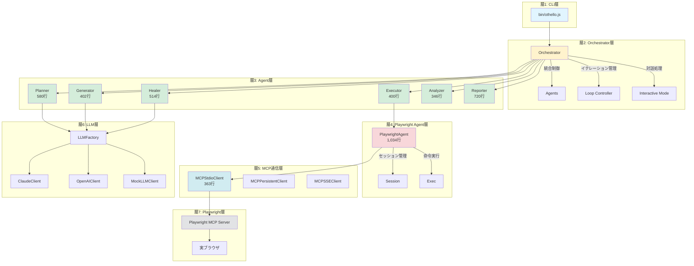
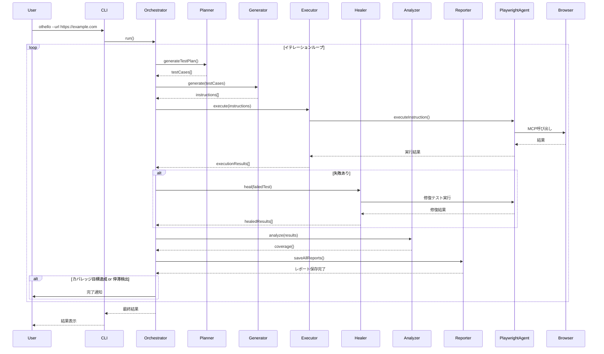
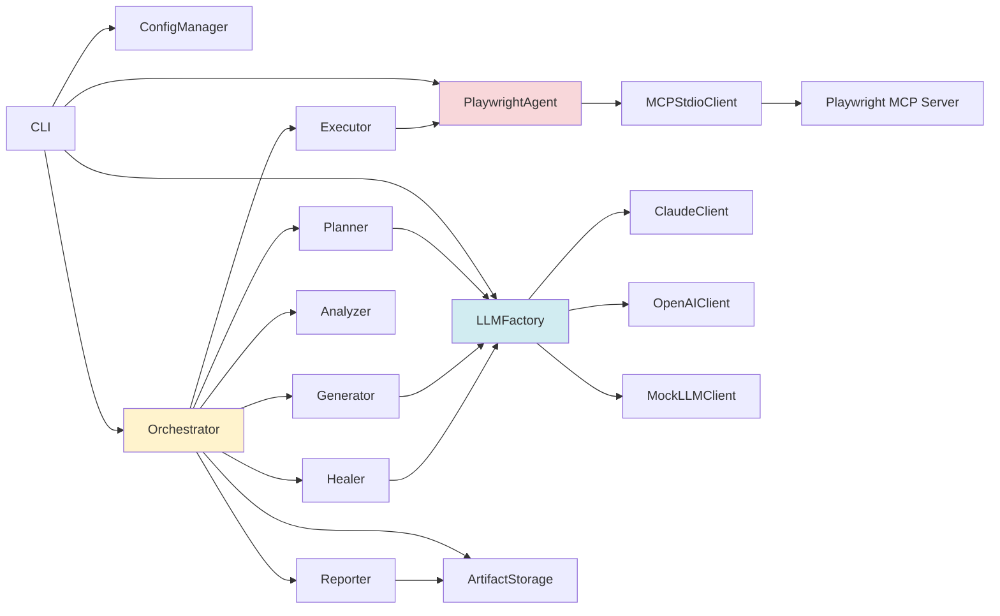

# Othelloプロジェクトの現状アーキテクチャ図

## 概要

このIssueでは、Othelloプロジェクトの現在のアーキテクチャを7層構造で詳細に説明します。

## アーキテクチャレイヤー構成

Othelloは以下の7層構造で構築されています：



## データフロー図



## 各層の詳細説明

### 層1: CLI層 (bin/othello.js)

**責務:**
- コマンドライン引数の解析
- 設定ファイルの読み込み
- モジュール初期化
- Orchestratorの起動

**主要機能:**
```bash
othello --url https://example.com \
        --max-iterations 10 \
        --coverage-target 80 \
        --llm-provider claude \
        --interactive
```

---

### 層2: Orchestrator層 (src/orchestrator.js - 809行)

**責務:**
- エージェント統合とライフサイクル制御
- イテレーションループの管理
- カバレッジ目標のチェック
- 対話モードの制御

**主要メソッド:**
- `run()` - メインループ実行
- `executeIteration()` - 単一イテレーション実行
- `checkStagnation()` - 停滞検出
- `handleInteractiveMode()` - 対話処理

**イテレーションフロー:**
```
1. テスト計画生成 (Planner)
2. MCP命令生成 (Generator)
3. テスト実行 (Executor)
4. 失敗修復 (Healer) ※必要時
5. カバレッジ分析 (Analyzer)
6. レポート生成 (Reporter)
7. 継続判定 → 次のイテレーション
```

---

### 層3: Agent層 (src/agents/*.js)

#### 1. OthelloPlanner (580行)
**責務:** テスト計画生成

**入力:**
- テスト観点CSV（23観点）
- 既存カバレッジ情報
- 未カバー観点リスト

**出力:**
```json
{
  "testCases": [
    {
      "test_case_id": "TC001",
      "aspect_no": 1,
      "title": "ホテル予約フォーム入力テスト",
      "steps": ["..."],
      "expected_results": ["..."]
    }
  ]
}
```

#### 2. OthelloGenerator (402行)
**責務:** テストケースをPlaywright MCP命令に変換

**入力:**
- Plannerからのテストケース
- ページSnapshot
- 対象URL

**出力:**
```json
{
  "instructions": [
    {
      "type": "navigate",
      "url": "https://example.com",
      "intent": "ページ移動"
    },
    {
      "type": "click",
      "ref": "button[id='submit']",
      "element": "送信ボタン",
      "intent": "フォーム送信"
    }
  ]
}
```

#### 3. OthelloExecutor (400行)
**責務:** MCP命令の実行と結果取得

**処理:**
- 命令の順次実行
- エラー発生時の即座な中断
- スナップショット取得
- スクリーンショット保存

#### 4. OthelloHealer (514行)
**責務:** 失敗したテストの分析と修復

**修復戦略（4段階）:**
```
Stage 1: Quick Wait Fix
  └─ 500ms待機を挿入して再実行

Stage 2: LLM-based Analysis
  └─ Snapshotを分析して根本原因を特定
  └─ 修正指示を生成して再実行

Stage 3: バグ判定
  └─ 修復不可能な場合はバグ報告

Stage 4: 報告
  └─ 修復結果をOrchestratorに返却
```

#### 5. OthelloAnalyzer (346行)
**責務:** カバレッジ計算と推奨生成

**出力:**
```json
{
  "percentage": 43.47,
  "covered": 10,
  "total": 23,
  "covered_aspects": [1, 2, 5, 7, ...],
  "uncovered_aspects": [3, 4, 6, 9, ...],
  "recommendations": [
    {
      "type": "failed_test",
      "test_id": "TC005",
      "reason": "前回失敗しました"
    }
  ]
}
```

#### 6. OthelloReporter (720行)
**責務:** マルチフォーマットレポート生成

**出力形式:**
- JSON - 機械可読性重視
- Markdown - GitHub互換
- HTML - ブラウザ表示（Chart.js使用）

---

### 層4: Playwright Agent層 (src/playwright-agent.js - 1,034行)

**責務:**
- セッション管理（初期化・終了）
- MCP命令の中継
- スナップショット取得
- エラーハンドリング

**主要機能:**
```javascript
// セッション初期化
await playwrightAgent.initializeSession();

// 命令実行
const result = await playwrightAgent.executeInstruction({
  type: 'click',
  selector: 'button[id="submit"]'
});

// スナップショット取得
const snapshot = await playwrightAgent.snapshot();

// セッション終了
await playwrightAgent.closeSession();
```

**モックモード対応:**
- テスト用にブラウザ操作をシミュレート
- 実際のPlaywrightなしで動作確認可能

---

### 層5: MCP通信層

#### MCPStdioClient (363行) ⭐ **推奨**

**通信方式:** Stdio（標準入出力）

**特徴:**
- 公式テストと同じ実装方式
- 単一プロセス内で完結
- エラーハンドリング充実
- stderr監視でデバッグ情報取得

**接続処理:**
```javascript
const transport = new StdioClientTransport({
  command: 'node',
  args: ['node_modules/@playwright/mcp/cli.js'],
  cwd: projectRoot
});

const client = new Client({ name, version });
await client.connect(transport);
```

#### MCPPersistentClient (379行) - 代替

**通信方式:** 永続的なHTTP KeepAlive

**特徴:**
- サーバーとクライアントを分離
- 複数クライアントから同時接続可能

#### MCPSSEClient (327行) - 代替

**通信方式:** Server-Sent Events

**特徴:**
- ストリーミング対応
- 大容量データに適している

---

### 層6: LLM層 (src/llm/*.js)

**アーキテクチャ:**
```
LLMFactory (抽象化レイヤー)
    │
    ├─ ClaudeClient (Anthropic API)
    ├─ OpenAIClient (OpenAI API)
    └─ MockLLMClient (テスト用)
```

**主要機能:**
- プロバイダ切り替え
- API呼び出しの抽象化
- エラーハンドリング
- レート制限対応

**使用箇所:**
- Planner（テスト計画生成）
- Generator（MCP命令生成）
- Healer（失敗原因分析）

---

### 層7: Playwright層

**構成要素:**
- Playwright MCP Server（公式: @playwright/mcp）
- Playwright API
- 実ブラウザ（Chromium/Firefox/WebKit）

**MCP Tools:**
- `browser_snapshot` - ページ状態取得
- `browser_navigate` - ページ遷移
- `browser_click` - 要素クリック
- `browser_type` - テキスト入力
- `browser_screenshot` - スクリーンショット
- その他多数

---

## コンポーネント依存関係図



## ファイル構成と成果物

```
Othello/
├── bin/
│   └── othello.js              # CLIエントリーポイント
├── src/
│   ├── orchestrator.js         # 統合制御
│   ├── playwright-agent.js     # MCP中継
│   ├── agents/                 # 6つの専門エージェント
│   │   ├── othello-planner.js
│   │   ├── othello-generator.js
│   │   ├── othello-executor.js
│   │   ├── othello-healer.js
│   │   ├── othello-analyzer.js
│   │   └── othello-reporter.js
│   ├── llm/                    # LLMプロバイダ
│   │   ├── llm-factory.js
│   │   ├── claude-client.js
│   │   ├── openai-client.js
│   │   └── mock-llm-client.js
│   └── mcp-*.js                # MCP通信クライアント
├── config/
│   ├── default.json            # デフォルト設定
│   └── test-ViewpointList.csv  # 23観点定義
├── reports/                    # 成果物出力先
│   ├── screenshots/
│   ├── planner-*.json
│   ├── generator-*.json
│   └── report-*.{json,md,html}
└── __tests__/                  # テストコード
```

## 実行フロー例

### イテレーション1の詳細フロー

```
1️⃣ Planner: テスト計画生成
   - CSV読み込み（23観点）
   - 優先度順にソート
   - 最初の5観点のテストケース生成
   📄 出力: planner-iteration-1.json

2️⃣ Generator: MCP命令生成
   - テストケースを受け取る
   - Snapshotを解析
   - LLMでMCP命令に変換
   📄 出力: generator-iteration-1-TC001.json

3️⃣ Executor: テスト実行
   - MCP命令を順次実行
   - TC001_step1: navigate() → 成功 ✅
   - TC001_step2: click() → 失敗 ❌
   - エラー発生で中断
   📷 出力: screenshot-TC001-step2.png

4️⃣ Healer: 失敗修復
   Stage 1: wait(500ms)挿入 → 再実行 → 失敗
   Stage 2: LLM分析
      → "セレクタ '#room' が見つかりません"
      → 修正指示生成
      → 修復テスト実行 → 成功 ✅

5️⃣ Analyzer: カバレッジ計算
   - 全テスト結果を集計
   - 2/23 観点 = 8.7%
   📊 出力: カバレッジデータ

6️⃣ Reporter: レポート生成
   📄 出力: report-session-*.{json,md,html}

7️⃣ 継続判定
   - Coverage < 80% → イテレーション2へ
```

## 対話モード (Interactive Mode)

```
イテレーション自動実行
    ↓
カバレッジ計算
    ↓
AI推奨テスト生成
    ├─ 失敗したテスト（再実行推奨）
    ├─ 未カバー観点（優先度順）
    ├─ より深いテスト（エッジケース）
    └─ 完了オプション
    ↓
ユーザー選択
    ├─ [0] 終了
    ├─ [1-N] 特定テスト実行
    ├─ [Enter] 次イテレーション
    └─ [深いテスト] AI推奨のエッジケース実行
```

## カバレッジ目標（23観点）

Othelloは以下の23観点のテストカバレッジ達成を目指します：

| No | 観点名 | 優先度 |
|----|--------|--------|
| 1 | 基本操作 | P0 |
| 2 | フォーム入力 | P0 |
| 3 | バリデーション | P1 |
| ... | ... | ... |
| 23 | アクセシビリティ | P3 |

※ 詳細は `config/test-ViewpointList.csv` を参照

## コード統計

| モジュール | 行数 | 責務 |
|-----------|------|------|
| orchestrator.js | 809 | エージェント統合・イテレーション制御 |
| playwright-agent.js | 1,034 | MCP中継・セッション管理 |
| othello-planner.js | 580 | テスト計画生成 |
| othello-reporter.js | 720 | レポート生成 |
| othello-healer.js | 514 | 失敗修復 |
| othello-generator.js | 402 | MCP命令生成 |
| othello-executor.js | 400 | テスト実行 |
| othello-analyzer.js | 346 | カバレッジ分析 |
| **合計（コア）** | **約5,805** | |

## アーキテクチャの強み

1. ✅ **明確な責務分離** - 各エージェントが1つの責務に特化
2. ✅ **LLM抽象化** - プロバイダ変更が容易
3. ✅ **スケーラビリティ** - イテレーションループが柔軟
4. ✅ **エラーハンドリング** - 多段階修復戦略
5. ✅ **テスト可能性** - モックモード対応
6. ✅ **マルチフォーマット出力** - JSON/Markdown/HTML
7. ✅ **対話モード** - ユーザー参加可能

## 今後の拡張性

- 新しいエージェントの追加が容易
- MCPプロバイダの切り替えが簡単
- LLMプロバイダの追加が可能
- テスト観点のカスタマイズが自由
- レポート形式の追加が可能

## 参考

- Issue #2: ザックリしたアーキテクト
- コードベース: `/home/user/Othello`
- ドキュメント: `/docs`
