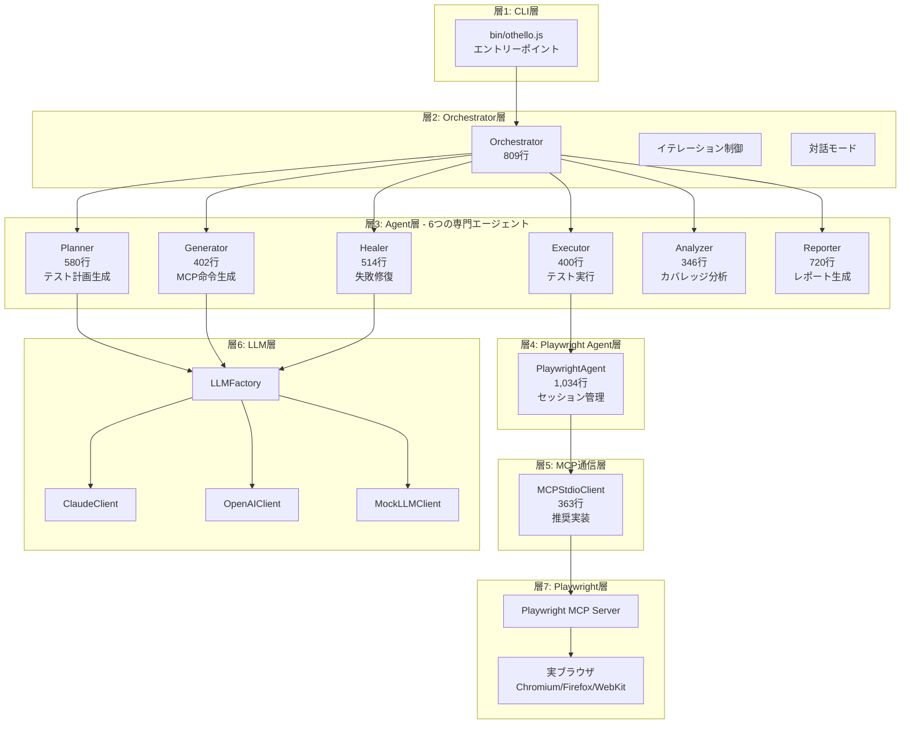

# Othelloプロジェクトの現状アーキテクチャ図

## 📋 概要

Othelloプロジェクトの現在のアーキテクチャを7層構造で詳細に説明します。このドキュメントは、新規開発者のオンボーディングや、システム理解の促進を目的としています。

## 🏗️ 7層アーキテクチャ構成



## 🔄 実行フロー（イテレーションループ）

```mermaid
sequenceDiagram
    participant User
    participant CLI
    participant Orch as Orchestrator
    participant Plan as Planner
    participant Gen as Generator
    participant Exec as Executor
    participant Heal as Healer
    participant Ana as Analyzer
    participant Rep as Reporter
    participant PA as PlaywrightAgent
    participant Browser

    User->>CLI: othello --url https://example.com
    CLI->>Orch: run()

    loop イテレーション (最大10回)
        Orch->>Plan: generateTestPlan()
        Plan-->>Orch: testCases[]

        Orch->>Gen: generate(testCases)
        Gen-->>Orch: instructions[]

        loop 各テストケース
            Orch->>Exec: execute(instructions)
            Exec->>PA: executeInstruction()
            PA->>Browser: MCP呼び出し
            Browser-->>PA: 結果
            PA-->>Exec: 実行結果
            Exec-->>Orch: executionResult

            alt 失敗時
                Orch->>Heal: heal(failedTest)
                Heal->>PA: 修復テスト実行
                PA-->>Heal: 修復結果
                Heal-->>Orch: healedResult
            end
        end

        Orch->>Ana: analyze(results)
        Ana-->>Orch: coverage{percentage, covered, uncovered}

        Orch->>Rep: saveAllReports()
        Rep-->>Orch: レポート保存完了

        alt カバレッジ >= 80% or 停滞検出
            Orch->>User: 完了通知
            break
        end
    end

    Orch-->>CLI: 最終結果
    CLI-->>User: 結果表示
```

## 📊 各層の詳細

### 層1: CLI層
- **ファイル**: `bin/othello.js`
- **責務**:
  - コマンドライン引数解析
  - 設定ファイル読み込み
  - モジュール初期化
  - Orchestrator起動

### 層2: Orchestrator層
- **ファイル**: `src/orchestrator.js` (809行)
- **責務**:
  - 6つのエージェントの統合制御
  - イテレーションループ管理
  - カバレッジ目標チェック
  - 対話モードの制御
  - 停滞検出

### 層3: Agent層

#### 1️⃣ Planner (580行)
**責務**: テスト計画生成
- CSV読み込み（23観点）
- 優先度順ソート
- テストケース生成

#### 2️⃣ Generator (402行)
**責務**: MCP命令生成
- テストケース → MCP命令変換
- Snapshot解析
- LLM変換

#### 3️⃣ Executor (400行)
**責務**: テスト実行
- MCP命令の順次実行
- エラー時の即座中断
- スクリーンショット保存

#### 4️⃣ Healer (514行)
**責務**: 失敗修復
- **Stage 1**: Quick Wait Fix (500ms待機挿入)
- **Stage 2**: LLM-based Analysis (根本原因分析)
- **Stage 3**: バグ判定
- **Stage 4**: 報告

#### 5️⃣ Analyzer (346行)
**責務**: カバレッジ分析
- 観点別カバレッジ計算
- テストケース成功率計算
- AI推奨生成（対話モード）

#### 6️⃣ Reporter (720行)
**責務**: レポート生成
- **JSON形式**: 機械可読性重視
- **Markdown形式**: GitHub互換
- **HTML形式**: ブラウザ表示（Chart.js）

### 層4: Playwright Agent層
- **ファイル**: `src/playwright-agent.js` (1,034行)
- **責務**:
  - セッション管理（初期化・終了）
  - MCP命令の中継
  - スナップショット取得
  - モックモード対応

### 層5: MCP通信層
- **推奨**: `MCPStdioClient` (363行) - Stdio通信
- **代替**: `MCPPersistentClient` - HTTP KeepAlive
- **代替**: `MCPSSEClient` - Server-Sent Events

### 層6: LLM層
- **LLMFactory**: プロバイダ抽象化
- **ClaudeClient**: Anthropic API実装
- **OpenAIClient**: OpenAI API実装
- **MockLLMClient**: テスト用モック

### 層7: Playwright層
- **Playwright MCP Server**: 公式 @playwright/mcp
- **Playwright API**: ブラウザ自動化
- **実ブラウザ**: Chromium/Firefox/WebKit

## 🎯 主要機能

### 1. イテレーションループ
```
イテレーション1 → カバレッジ8.7%
イテレーション2 → カバレッジ21.7%
イテレーション3 → カバレッジ43.5%
...
イテレーションN → カバレッジ >= 80% (目標達成)
```

### 2. 4段階修復戦略
```
失敗テスト
  ↓
Stage 1: 500ms待機挿入 → 再実行
  ↓ (失敗)
Stage 2: LLM根本原因分析 → 修正 → 再実行
  ↓ (失敗)
Stage 3: バグ判定
  ↓
Stage 4: 報告
```

### 3. 対話モード
```
自動実行完了
  ↓
AI推奨テスト表示
  ├─ 失敗テスト再実行
  ├─ 未カバー観点テスト
  ├─ より深いテスト（エッジケース）
  └─ 完了
  ↓
ユーザー選択 → 追加実行 or 終了
```

### 4. マルチフォーマットレポート
- **report-session-XXX.json** - 機械可読
- **report-session-XXX.md** - GitHub表示
- **report-session-XXX.html** - ブラウザ表示

## 📁 ファイル構成

```
Othello/
├── bin/
│   └── othello.js              # CLIエントリーポイント
├── src/
│   ├── orchestrator.js         # エージェント統合 (809行)
│   ├── playwright-agent.js     # MCP中継 (1,034行)
│   ├── agents/                 # 6つの専門エージェント
│   │   ├── othello-planner.js      (580行)
│   │   ├── othello-generator.js    (402行)
│   │   ├── othello-executor.js     (400行)
│   │   ├── othello-healer.js       (514行)
│   │   ├── othello-analyzer.js     (346行)
│   │   └── othello-reporter.js     (720行)
│   ├── llm/                    # LLMプロバイダ
│   │   ├── llm-factory.js
│   │   ├── claude-client.js
│   │   ├── openai-client.js
│   │   └── mock-llm-client.js
│   └── mcp-*.js                # MCP通信クライアント
├── config/
│   ├── default.json            # デフォルト設定
│   └── test-ViewpointList.csv  # 23観点定義
├── reports/                    # 成果物出力先
│   ├── screenshots/
│   ├── planner-*.json
│   ├── generator-*.json
│   └── report-*.{json,md,html}
└── __tests__/                  # テストコード
```

## 📊 コード統計

| モジュール | 行数 | 責務 |
|-----------|------|------|
| orchestrator.js | 809 | エージェント統合・イテレーション制御 |
| playwright-agent.js | 1,034 | MCP中継・セッション管理 |
| othello-planner.js | 580 | テスト計画生成 |
| othello-reporter.js | 720 | レポート生成 |
| othello-healer.js | 514 | 失敗修復 |
| othello-generator.js | 402 | MCP命令生成 |
| othello-executor.js | 400 | テスト実行 |
| othello-analyzer.js | 346 | カバレッジ分析 |
| **合計（コア）** | **約5,805** | |

## ✅ アーキテクチャの強み

1. **明確な責務分離** - 各エージェントが1つの責務に特化
2. **LLM抽象化** - プロバイダ変更が容易（Claude/OpenAI/Mock）
3. **スケーラビリティ** - イテレーションループが柔軟
4. **エラーハンドリング** - 多段階修復戦略
5. **テスト可能性** - モックモード対応
6. **マルチフォーマット出力** - JSON/Markdown/HTML
7. **対話モード** - ユーザー参加可能

## 🚀 今後の拡張性

- ✅ 新しいエージェントの追加が容易
- ✅ MCPプロバイダの切り替えが簡単
- ✅ LLMプロバイダの追加が可能
- ✅ テスト観点のカスタマイズが自由
- ✅ レポート形式の追加が可能

## 📚 関連ドキュメント

- 詳細アーキテクチャ: `docs/architecture-issue.md`
- Issue #2: ザックリしたアーキテクト
- コードベース: `/home/user/Othello`

## 📝 使用例

```bash
# 基本実行
othello --url https://example.com

# 詳細設定
othello --url https://example.com \
        --max-iterations 20 \
        --coverage-target 90 \
        --llm-provider claude \
        --browser chromium \
        --interactive \
        --headless false

# 対話モード
othello --url https://example.com --interactive
```

## 🎯 カバレッジ目標（23観点）

Othelloは以下の23観点のテストカバレッジ達成を目指します：

| No | 観点名 | 優先度 |
|----|--------|--------|
| 1 | 基本操作 | P0 |
| 2 | フォーム入力 | P0 |
| 3 | バリデーション | P1 |
| 4 | エラー処理 | P1 |
| 5 | ナビゲーション | P1 |
| ... | ... | ... |
| 23 | アクセシビリティ | P3 |

※ 詳細は `config/test-ViewpointList.csv` を参照

---

**このアーキテクチャドキュメントは、Issue #2 のコンセプトを実装した現状のシステム構成を詳細化したものです。**
